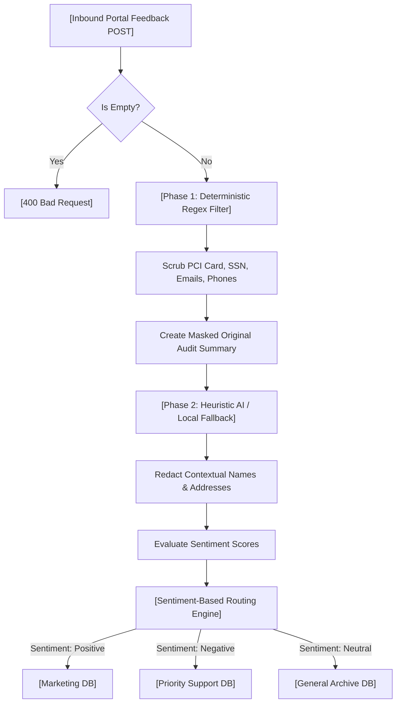

# Business Requirements Document (BRD)

**Project Title**: GuardRail - Open Source Customer Feedback Redaction & Sentiment Routing Microservice  
**Document Version**: 2.0.0  
**Author**: Antigravity AI Partner  
**Target Audience**: DevOps Engineers, Security Officers, Compliance Managers, and Developers  

---

## 1. Executive Summary
A major healthcare and fintech platform receives thousands of daily customer feedback submissions through its web portals. A significant percentage of this inbound data contains highly sensitive Personally Identifiable Information (PII) and Protected Health Information (PHI) such as Credit Card numbers, Social Security Numbers (SSN), Health IDs, phone numbers, and email addresses. 

Storing or exposing this raw data in general-purpose downstream systems (e.g., Marketing, Product Analytics, or General Support) breaches regulatory standards under **GDPR, CCPA, HIPAA, and PCI-DSS**. 

**GuardRail** is a lightweight, high-performance Node.js / Express microservice that solves this problem by:
1. **Redacting PII/PHI**: Scrubbing sensitive data patterns into a standardized `[REDACTED]` token before storage.
2. **Obscuring Audit Trails**: Storing masked versions of the text (e.g., `****-****-****-1234` or `j***e@g***.com`) for operators to verify context without exposing compliance-violating data.
3. **Sentiment-Based Routing**: Analyzing feedback tone and routing clean data to specific database channels.
4. **Deploying Easily**: Operating completely offline using local rule-based heuristics out-of-the-box, with optional OpenAI/Ollama-compatible LLM support.

---

## 2. Project Scope

### In-Scope
* **Regex Filtering**: Deterministic scrubbing of Credit Card numbers, Phone numbers, Email addresses, and Health ID/SSN patterns.
* **Contextual AI Scrubbing**: Natural Language Processing (NLP) heuristics and Open Source LLM connections to redact names, addresses, and IP addresses.
* **Sentiment Assessment**: Evaluation of user tone into Positive, Negative, or Neutral classes.
* **Simulated DB Routing**: Automated data ingestion and division into separate JSON databases.
* **Automated Regression Testing**: Coverage for edge cases, composite PII payloads, and empty validations using Vitest and Supertest.

### Out-of-Scope
* Persistent production databases (simulated locally via JSON files).
* Multi-user role management and authentication.
* Out-of-band notifications (e.g., direct email alerts for negative feedback).

---

## 3. Data Processing Architecture & Flow

The GuardRail pipeline processes inbound text packages sequentially to guarantee that no unscrubbed PII ever touches persistent storage.

---

## 4. Technical Specifications

### A. Data Classification & Redaction Rules

| Data Category | Formats Covered | Strategy | Action / Token Replacement |
| :--- | :--- | :--- | :--- |
| **Credit Cards (PCI)** | 13-16 digit numbers with spaces or hyphens. | Deterministic Regex | `[REDACTED]` (Masked: `****-****-****-4444`) |
| **Emails** | RFC 5322 standard electronic mail formats. | Deterministic Regex | `[REDACTED]` (Masked: `j***e@g***.com`) |
| **Phone Numbers** | Standard US 10-digit, international formats. | Deterministic Regex | `[REDACTED]` (Masked: `(***) ***-7890`) |
| **SSN / Health IDs** | Hyphenated SSNs (`AAA-GG-SSSS`) or 10-char Health IDs. | Deterministic Regex | `[REDACTED]` (Masked: `***-**-6789`) |
| **Contextual PII** | Full names, addresses, credentials, IP addresses. | LLM / Heuristics | `[REDACTED]` (Masked: Removed) |

### B. Routing Destination Mappings

Feedback is mapped dynamically to simulated database partitions based on sentiment outcomes:

> [!NOTE]
> **Priority Support Database**  
> *Triggered By:* Negative sentiment (e.g., reports of bugs, payment crashes, or angry tones).  
> *Action:* Routed for immediate support remediation.

> [!TIP]
> **Marketing Database**  
> *Triggered By:* Positive sentiment (e.g., praise, customer satisfaction, compliments).  
> *Action:* Routed for promotional opportunities or customer testimonials.

> [!IMPORTANT]
> **General Archive Database**  
> *Triggered By:* Neutral sentiment (e.g., feature inquiries, standard informational queries, suggestions).  
> *Action:* Routed for product analytics and standard tracking.

---

## 5. Compliance & Security Standards
* **Data Minimization**: Raw, unscrubbed PII must never be stored in files or database columns.
* **Masked Audit Trails**: Operators can view structural/masked PII representations to understand message context without seeing raw values.
* **Dependency Audits**: Removed proprietary SDKs (e.g., `@google/genai`) to ensure license compliance and eliminate vendor lock-in.

---

## 6. Testing & Quality Assurance

All features must pass the automated regression suite powered by **Vitest** and **Supertest**. 

### Critical Assertions Verified:
1. **Rule Redaction Verification**: Ensures credit card numbers and email strings are replaced.
2. **Routing Correctness**: Confirms positive sentiment lands in marketing, negative in priority support, and neutral in general archive.
3. **Validation Verification**: Asserts that sending an empty string or null body returns `400 Bad Request` and does not crash the Express app.
4. **Mock Dataset Verification**: Dynamically loads `src/data/sample_data.json` and runs all samples sequentially to verify end-to-end routing integrity.
